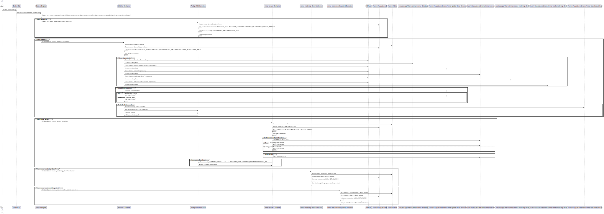

# MMAR Metamodeling Platform - Docker Installation

Welcome to the **MMAR Docker Installation** repository! This guide will walk you through installing and managing the MMAR platform using Docker. Installing MMAR with Docker simplifies setup, minimizes potential issues, and provides an efficient environment for both development and production.

## Installation

### Prerequisites

Ensure that you have the following software installed on your machine:

- [Docker](https://docs.docker.com/get-docker/)

Clone the repository to your local machine and navigate to the directory:

<!-- https://github.com/MM-AR/mmar-docker-installation.git --> 
```bash
git clone https://github.com/MM-AR/mmar-docker-installation.git
cd mmar-docker-installation
```

Make sure that docker is running. You can check this by running the following command or just open the Docker Desktop application:

```bash
docker info
```

You can install and start the MMAR environment using a single command depending on your desired mode:

---
### Quick Start Production Mode

Before starting the production mode, make sure that you adapt the `.env` file to your needs. You can find the file in the `root` directory.
If you want to run the production mode on a local machine and expose it to localhost, check the environment variables `API_URL` and `ALLOWED_HOSTS` to `localhost` (in the files `.env-mmar-metamodeling-client-prod` and `.env-mmar-modeling-client-prod`). The `API_URL` should be set to `http` and not `https`. (By default no changes needed).

If you want to run the production mode on a production server, set the environment variable `API_URL` and `ALLOWED_HOSTS` to the domain name of your server and use `https` for the `API_URL`. 

To start the production mode, run:

```bash
docker compose --env-file .env up
```

To stop the production mode, run:

```bash
docker compose --env-file .env down
```

To completely remove all containers, images, and volumes associated with MMAR, use:

```bash
docker compose down --rmi all --volumes
```
---

### Quick Start Development Mode

If you want to develop something for the MMAR platform, you can use the development mode. This mode is not recommended for production use. This mode is exposed to localhost. You can access it by using the VS Code Remote Development extension.

The development mode uses the `.env-dev` file for configuration. You can find the file in the `root` directory. You can change the environment variables in this file to suit your needs.

If you want to run the development mode on a local machine and expose it to localhost (default scenario), set the environment variables `API_URL` and `ALLOWED_HOSTS` to `localhost` (in the files `.env-mmar-metamodeling-client-dev` and `.env-mmar-modeling-client-dev`). The `API_URL` should be set to `http` and not `https` (by default no changes needed).

To start the development mode, run:
```bash
docker compose --env-file .env-dev up
```

This will set up and start the necessary containers for MMAR. The first time you run this command, it may take a while to download the required images and set up the containers. Subsequent runs will be faster as Docker caches the images. 

Check the console output for any errors. If everything is set up correctly, you can access the API Server at [http://localhost:8000/login](http://localhost:8000/login), the Modeling Client at [http://localhost:8080](http://localhost:8080), and the Metamodeling Client at [http://localhost:8070](http://localhost:8070). 

By using the VS Code Remote Development extension (See section `Attach Container to VSCode`), you can access the code base in an IDE to make changes. 

Note that the development server does start the node projects of the API server, the modeling client, and the metamodeling client by default at start up. Check the console outputs of the containers to see if everything is running correctly. You can also check the output during development.

To stop the development mode, run:

```bash
docker compose --env-file .env-dev down
```

To completely remove all containers, images, and volumes associated with MMAR, use:

```bash
docker compose down --rmi all --volumes
```

---


## Attach Container to VSCode
If you are in development mode, open VSCode and open a remote connection in your VSCode Desktop installation.

To attach a running container in VSCode, follow these instructions: https://code.visualstudio.com/docs/devcontainers/attach-container
```It should be sufficient to just attach the running Docker container. You do not have to configure additional settings.```

The repositories are located in the shared volume ```/usr/src/app/shared/mmar``` directory. You can either attach just one container and open the mmar directory to see all the repository projects, or you can attach all the containers and open the mmar directory in each container separately.

Be aware that most users are not allowed to push directly to the main and develop branches. By default, the development container fetches the development branch. If you want to develop your own features, create a fork of the repository you are working on. When finished, create a ```pull request``` to the develop branch.

## Configuration

The MMAR platform can be configured using environment variables. These variables are defined in the `.env` files located in the `root` directory. You can modify these files to suit your needs. `.env-dev` and `.env` are for the configuration of the Docker variables. All the `.env-mmar...` files, located in the `conf` forlder of each container folder, are passed on to the different project folders. Only change something if you know what you are doing. By default, you can just let the files as they are. (see section `Environment Variables` for more details).

> **<span style="color:gold">Hint:</span> If your machine has ample resources (i.e. >= 16GB), you can remove all memory and CPU limits in the `docker-compose.yml` file to speed up the build process for all containers.**

## Environment Variables

The MMAR platform is configured using environment variables defined in the `.env` and `.env-dev` files in the root directory, as well as `.env-mmar-*` files in each service's `conf` folder. Below is a comprehensive list of all relevant variables, their purpose, and where they are used.

### PostgreSQL Configuration

- `POSTGRES_USER`: Username for the PostgreSQL database (default: `api`)
- `POSTGRES_PASSWORD`: Password for the PostgreSQL database (default: `root`)
- `POSTGRES_DB`: Name of the PostgreSQL database (default: `api`)
- `POSTGRES_HOST`: Hostname for the PostgreSQL database (should be `database` for Docker Compose networking)

### General Configuration

- `GIT_BRANCH`: The branch of the Git repository to use (e.g., `main`, `develop`)
- `PRODUCTION`: Set to `true` for production mode, `false` for development mode
- `DELETE_NODE_MODULES`: Also used in scripts for node_modules cleanup (set to `true` or `false`)

### API Server Configuration

- `API_SERVER_PORT`: The port on which the API server will run (default: `8000`)
- `HTTPPORT`: The port for the Node.js API server (used in `.env-mmar-api`, default: `8000`)
- `JWT_SECRET`: Secret key for JWT authentication (used in `.env-mmar-api`)
- `TOKEN_EXPIRE_TIME`: Expiration time for JWT tokens in ms (used in `.env-mmar-api`, default: `86400000`)

### Client Configuration (Vizrep, Modeling and Metamodeling Client)

- `API_URL`: URL of the API endpoint (e.g., `http://localhost:8000` for local, or your domain for production)
- `HTTPS`: Set to `true` to enable HTTPS, `false` otherwise
- `ANALYZE`: Set to `true` to enable bundle analysis, `false` otherwise
- `PORT`: The port on which the client will run (e.g., `8080` for modeling, `8070` for metamodeling)
- `COMPRESS`: Set to `true` to enable compression, `false` otherwise
- `ALLOWED_HOSTS`: Comma-separated list of allowed hosts (e.g., `localhost` or your domain)
- `ERRORS`, `WARNINGS`, `RUNTIME_ERRORS`: Set to `true` to enable overlays for errors, warnings, and runtime errors respectively
- `HOT`, `LIVE_RELOAD`: Set to `true` to enable hot reload and live reload respectively
- `USERNAME`, `PASSWORD`: Default user credentials for the client (default: `admin`/`admin`)
- `CI`: Set to `true` to open the Bero user interface after the server starts

### Performance and Resource Limits

Set these in your `.env` or `.env-dev` to control Docker resource allocation for each container. These variables are referenced in docker-compose.yml and determine the memory and CPU limits for each service.

- `DB_SERVER_MEMORY_LIMIT`: Memory limit for the database container (e.g., `2G`)
- `DB_SERVER_CPU_LIMIT`: CPU limit for the database container (e.g., `2`)
- `API_SERVER_MEMORY_LIMIT`: Memory limit for the API server container (e.g., `2G`)
- `API_SERVER_CPU_LIMIT`: CPU limit for the API server container (e.g., `2`)
- `MODELING_CLIENT_MEMORY_LIMIT`: Memory limit for the modeling client container (e.g., `2G`)
- `MODELING_CLIENT_CPU_LIMIT`: CPU limit for the modeling client container (e.g., `2`)
- `METAMODELING_CLIENT_MEMORY_LIMIT`: Memory limit for the metamodeling client container (e.g., `2G`)
- `METAMODELING_CLIENT_CPU_LIMIT`: CPU limit for the metamodeling client container (e.g., `2`)`
- `VIZREP_CLIENT_MEMORY_LIMIT`: Memory limit for the Vizrep container (e.g., `4G`)
- `VIZREP_CLIENT_CPU_LIMIT`: CPU limit for the Vizrep container (e.g., `2`)

How it works:

These variables are used in the mem_limit and cpus fields of each service in `docker-compose.yml`.
If a variable is not set, a default value is used (e.g., 2G for memory, 2 for CPU).
You can adjust these values in .env (for production) or .env-dev (for development) to fit your system’s resources. 

> **<span style="color:gold">Attention:</span> The Monaco editor in the Vizrep client needs a lot of resources during the build process. If your machine has ample resources, you can remove all memory and CPU limits in the `docker-compose.yml` file to speed up the build process for all containers.**

### Notes

- The `.env` file is used for production, `.env-dev` for development.
- Each client and server service has its own `.env-mmar-*` file in its `conf` folder for additional configuration.
- For local development, set `API_URL` and `ALLOWED_HOSTS` to `localhost` in the relevant `.env-mmar-*` files.
- For production, set `API_URL` and `ALLOWED_HOSTS` to your domain and use `https` for `API_URL`.

**Always restart your containers after changing environment variables.**

## Sequence Diagram 
The following sequence diagram illustrates the set up of the Docker project. Other sequence diagrams can be found in the `images` folder. 



## Contributing

We welcome contributions! Feel free to fork the repository, create feature branches, and submit pull requests.

## License

This repository is licensed under the GNU AFFERO GENERAL PUBLIC LICENSE Version 3.

## Authors
- [Fabian Muff](https://www.unifr.ch/inf/digits/en/group/team/fabian-muff.html) - [GitHub](https://github.com/fabian-muff)

